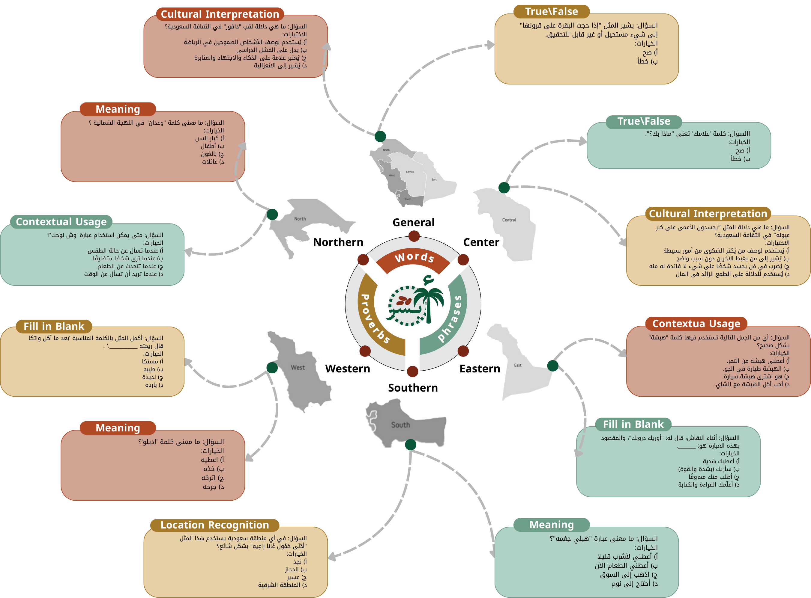

# Absher: Evaluating the Linguistic and Cultural Competence of LLMs in Saudi Dialects


[](https://www.sciencedirect.com/science/article/pii/S1110016825012487)
[](#overview)
[](#dataset-description)
[](#task-types)
[](#dataset-statistics)


## Overview
Absher is a culturally grounded benchmark designed to evaluate the ability of Large Language Models (LLMs) to understand Saudi Arabic dialects and their associated cultural knowledge. Existing evaluation benchmarks often focus on Modern Standard Arabic or high-resource languages, overlooking the rich regional and cultural diversity of Saudi Arabia.

To address this gap, Absher provides a large-scale collection of **over 18,000 multiple-choice questions**, derived from curated dialectal **words, phrases, and proverbs** representing five major Saudi regions. The benchmark enables systematic and fine-grained evaluation of both linguistic understanding and cultural reasoning.

---

## Dataset Overview

<p align="center">
  
</p>

<p align="left">
  <em>
  Overview of Absher, covering all regions of Saudi Arabia (five specific regions and one general category),
  and presenting representative examples from its three content types: words, phrases, and proverbs.
  The benchmark also spans six question types: Meaning, True/False, Fill-in-the-Blank, Contextual Usage,
  Cultural Interpretation, and Location Recognition.
  </em>
</p>

---

## Dataset Description

The Absher dataset is constructed to support fine-grained evaluation of linguistic and cultural competence in Arabic LLMs.  
It captures dialectal diversity and culturally grounded expressions commonly used in Saudi society.

The dataset is organized into three primary content types:

- **Words**: Individual dialectal terms with specific cultural or regional meanings  
- **Phrases**: Common expressions and idiomatic usages  
- **Proverbs**: Traditional sayings reflecting cultural values and social norms  

Each entry is enriched with contextual and regional information and used to generate multiple evaluation questions.

---

## Task Types

Absher supports six complementary multiple-choice evaluation task types:

1. **Meaning** – Identify the correct meaning of a given word, phrase, or proverb  
2. **True / False** – Verify the correctness of a statement related to the item  
3. **Fill-in-the-Blank** – Complete a sentence using the appropriate expression  
4. **Contextual Usage** – Select the most suitable usage scenario  
5. **Cultural Interpretation** – Interpret the cultural or social implication  
6. **Location Recognition** – Identify the Saudi region associated with the item  

These tasks jointly assess semantic understanding, contextual reasoning, and cultural awareness.

---

## Regional Coverage

The benchmark covers dialectal and cultural content from the following regions:

- Central  
- Western  
- Southern  
- Northern  
- Eastern  
- General (expressions widely used across regions)

This diversity enables evaluation of both region-specific and shared cultural knowledge.

---

## Dataset Statistics

| Category | Terms | Questions |
|----------|-------|-----------|
| Words    | 2,533 | 15,198    |
| Phrases  | 478   | 2,868     |
| Proverbs | 83    | 498       |
| **Total**| **3,094**  | **18,564**  |

---
### File Format

The Absher dataset is divided into three content categories: **Words**, **Phrases**, and **Proverbs**.
Each category includes six files corresponding to the evaluation tasks:
Meaning, True/False, Fill-in-the-Blank, Contextual Usage, Cultural Interpretation, and Location Recognition.

All files follow a consistent structure and contain **five columns**:

| Column Name | Description |
|-------------|-------------|
| Term | Dialectal word, phrase, or proverb |
| Meaning_of_term | Brief explanation of the term |
| Dialect_type | Associated Saudi region dialect |
| Question | Multiple-choice question |
| Correct_answer | Correct answer option |

>  **Note:** **All questions were generated using Large Language Model (LLM).**

---
## 🌟 Demo

🔗 https://saudiculture.malhaig.online/

This interactive website "**Cultural Identity of the Kingdom**" has integrated our Absher dataset to help researchers and the public explore the rich diversity of Saudi culture. 

We would like to acknowledge the team behind the website for utilizing the Absher benchmark as one of the resources integrated into the platform.

---
## Citation

```bibtex
@article{ALMONEF202625,
title = {From words to proverbs: Evaluating LLMs’ linguistic and cultural competence in Saudi dialects with Absher},
journal = {Alexandria Engineering Journal},
volume = {137},
pages = {25-41},
year = {2026},
issn = {1110-0168},
doi = {https://doi.org/10.1016/j.aej.2025.12.066},
url = {https://www.sciencedirect.com/science/article/pii/S1110016825012487},
author = {Renad Al-Monef and Hassan Alhuzali and Nora Alturayeif and Ashwag Alasmari},
keywords = {Large language models, Natural language processing, Cultural aware LLMs, Dialects understanding},
abstract = {As large language models (LLMs) become increasingly central to Arabic NLP applications, their effectiveness in linguistically diverse settings, particularly regions with rich dialectal variation such as Saudi Arabia, remains underexplored. Existing evaluation paradigms tend to prioritize high-resource languages or Modern Standard Arabic (MSA), overlooking regional linguistic and cultural specificities. This leads to performance limitations and cultural biases in real-world deployments. To address this gap, we introduce Absher, the first comprehensive and fine-grained benchmark designed to assess the understanding of LLMs regarding Saudi dialects and their embedded cultural nuances. Absher consists of over 18,000 multiple choice questions derived from a curated dataset of dialectal words, phrases, and proverbs sourced from five major Saudi regions. The benchmark spans six task categories: Meaning, True/False, Fill-in-the-Blank, Contextual Usage, Cultural Interpretation, and Location Recognition, enabling multifaceted evaluation across both linguistic and cultural dimensions. We perform zero-shot evaluations on six state-of-the-art open LLMs: ALLaM, LLaMA, Jais, Mistral, Qwen, and AceGPT. Our results reveal substantial performance variability across dialects and question types. Qwen achieved the highest overall accuracy, excelling in word-level questions (63%), while ALLaM outperformed others in the interpretation of proverbs (48% accuracy). All models struggled with content from underrepresented dialects, particularly Southern and Eastern variants, and with context-free True/False questions, highlighting weaknesses in dialect grounding and binary reasoning. These findings demonstrate the need for dialect-aware training and culturally aligned evaluation. We position Absher as a critical step toward more equitable and effective LLMs development for real-world Arabic applications.}
}
